# Project 3: Proactive Monitoring & Security Auto-Remediation for EC2

## Overview
This project implements a comprehensive monitoring and security auto-remediation system for EC2 instances using AWS CloudWatch, Lambda, and various security services. The system proactively monitors infrastructure health and automatically responds to security threats and performance issues.

## Architecture

### Architecture Diagram

```mermaid
graph TB
    %% EC2 Instances
    EC2_1[("💻 EC2 Instance 1")]
    EC2_2[("💻 EC2 Instance 2")]
    EC2_3[("💻 EC2 Instance 3")]
    
    %% Monitoring Services
    CW[("📈 CloudWatch")]
    CW_LOGS[("📝 CloudWatch Logs")]
    CW_METRICS[("📊 CloudWatch Metrics")]
    CW_ALARMS[("🚨 CloudWatch Alarms")]
    CW_DASH[("📋 CloudWatch Dashboard")]
    
    %% Security Services
    GD[("🛡️ GuardDuty")]
    SH[("🔒 Security Hub")]
    CONFIG[("⚙️ AWS Config")]
    
    %% Auto-Remediation
    AR[("🤖 Auto-Remediation Lambda")]
    CR[("💰 Cost Optimizer Lambda")]
    SR[("🔐 Security Response Lambda")]
    CM[("📋 Compliance Monitor Lambda")]
    
    %% Event Processing
    EB[("⚡ EventBridge")]
    
    %% Notifications
    SNS[("📢 SNS")]
    EMAIL[("📧 Email Alerts")]
    SLACK[("💬 Slack Notifications")]
    
    %% VPC Components
    VPC[("🏠 VPC")]
    SG[("🛡️ Security Groups")]
    IAM[("👤 IAM Roles")]
    
    %% Data Flow - Monitoring
    EC2_1 --> CW_METRICS
    EC2_2 --> CW_METRICS
    EC2_3 --> CW_METRICS
    EC2_1 --> CW_LOGS
    EC2_2 --> CW_LOGS
    EC2_3 --> CW_LOGS
    
    %% Security Monitoring
    EC2_1 --> GD
    EC2_2 --> GD
    EC2_3 --> GD
    EC2_1 --> CONFIG
    EC2_2 --> CONFIG
    EC2_3 --> CONFIG
    
    %% Data Aggregation
    CW_METRICS --> CW
    CW_LOGS --> CW
    GD --> SH
    CONFIG --> SH
    
    %% Alarm Processing
    CW --> CW_ALARMS
    CW_ALARMS --> EB
    SH --> EB
    CONFIG --> EB
    
    %% Auto-Remediation
    EB --> AR
    EB --> CR
    EB --> SR
    EB --> CM
    
    %% Remediation Actions
    AR --> EC2_1
    AR --> EC2_2
    AR --> EC2_3
    CR --> EC2_1
    CR --> EC2_2
    CR --> EC2_3
    SR --> SG
    CM --> CONFIG
    
    %% Notifications
    CW_ALARMS --> SNS
    SH --> SNS
    AR --> SNS
    CR --> SNS
    SR --> SNS
    CM --> SNS
    
    SNS --> EMAIL
    SNS --> SLACK
    
    %% Dashboard
    CW --> CW_DASH
    
    %% Security
    SG --> EC2_1
    SG --> EC2_2
    SG --> EC2_3
    IAM --> AR
    IAM --> CR
    IAM --> SR
    IAM --> CM
    
    %% VPC
    VPC --> EC2_1
    VPC --> EC2_2
    VPC --> EC2_3
    
    %% Styling
    classDef aws fill:#FF9900,stroke:#232F3E,stroke-width:2px,color:#fff
    classDef monitoring fill:#2196F3,stroke:#1565C0,stroke-width:2px,color:#fff
    classDef security fill:#F44336,stroke:#C62828,stroke-width:2px,color:#fff
    classDef lambda fill:#9C27B0,stroke:#6A1B9A,stroke-width:2px,color:#fff
    classDef notification fill:#4CAF50,stroke:#2E7D32,stroke-width:2px,color:#fff
    classDef network fill:#FF9800,stroke:#E65100,stroke-width:2px,color:#fff
    
    class EC2_1,EC2_2,EC2_3 aws
    class CW,CW_LOGS,CW_METRICS,CW_ALARMS,CW_DASH monitoring
    class GD,SH,CONFIG security
    class AR,CR,SR,CM,EB lambda
    class SNS,EMAIL,SLACK notification
    class VPC,SG,IAM network
```

### Core Components
- **Monitoring**: CloudWatch Metrics, Logs, and Alarms
- **Security**: AWS Security Hub, GuardDuty, Config
- **Auto-Remediation**: Lambda functions for automated responses
- **Notification**: SNS for alerts and notifications
- **Dashboard**: CloudWatch Dashboard for visualization
- **Compliance**: AWS Config for compliance monitoring

## Components
1. **CloudWatch Monitoring Setup**
2. **Security Monitoring (GuardDuty, Security Hub)**
3. **Auto-Remediation Lambda Functions**
4. **SNS Notification System**
5. **CloudWatch Dashboard**
6. **AWS Config Rules**
7. **EventBridge Rules for Automation**

## Monitoring Features
- CPU, Memory, Disk, and Network monitoring
- Application performance monitoring
- Security event monitoring
- Compliance monitoring
- Cost optimization monitoring

## Auto-Remediation Actions
- Automatic instance restart on critical failures
- Security group updates for detected threats
- Resource scaling based on metrics
- Compliance violation remediation
- Cost optimization actions

## Security Features
- Threat detection and response
- Vulnerability scanning
- Compliance monitoring
- Access pattern analysis
- Automated security updates
