# Project 4: Debugging a Broken Serverless Contact Form Workflow

## Overview
This project demonstrates debugging a broken serverless contact form workflow using AWS Lambda, API Gateway, S3, and DynamoDB. The project includes intentional issues that need to be identified and fixed, simulating real-world troubleshooting scenarios.

## Architecture

### Architecture Diagram

```mermaid
graph TB
    %% Users
    USER[("👤 Users")]
    
    %% Frontend
    S3[("🪣 S3 Static Website")]
    CF[("☁️ CloudFront CDN")]
    
    %% API Gateway
    APIGW[("🌐 API Gateway")]
    
    %% Lambda Functions
    LAMBDA1[("⚡ Contact Handler Lambda")]
    LAMBDA2[("⚡ Broken Contact Handler Lambda")]
    
    %% Database
    DDB[("🗄️ DynamoDB")]
    
    %% Notifications
    SNS[("📢 SNS")]
    EMAIL[("📧 Email Notifications")]
    
    %% Monitoring
    CW[("📈 CloudWatch")]
    XR[("🔍 X-Ray")]
    LOGS[("📝 CloudWatch Logs")]
    
    %% Security
    IAM[("👤 IAM Roles")]
    CORS[("🔒 CORS Policy")]
    
    %% Data Flow
    USER --> CF
    CF --> S3
    USER --> APIGW
    
    %% API Processing
    APIGW --> LAMBDA1
    APIGW --> LAMBDA2
    
    %% Database Operations
    LAMBDA1 --> DDB
    LAMBDA2 --> DDB
    
    %% Notifications
    LAMBDA1 --> SNS
    LAMBDA2 --> SNS
    SNS --> EMAIL
    
    %% Monitoring
    LAMBDA1 --> CW
    LAMBDA2 --> CW
    LAMBDA1 --> XR
    LAMBDA2 --> XR
    CW --> LOGS
    
    %% Security
    IAM --> LAMBDA1
    IAM --> LAMBDA2
    CORS --> APIGW
    
    %% Debugging Flow
    LOGS -.->|"🐛 Debug Issues"| LAMBDA2
    XR -.->|"🔍 Trace Problems"| LAMBDA2
    CW -.->|"📊 Monitor Performance"| LAMBDA2
    
    %% Styling
    classDef aws fill:#FF9900,stroke:#232F3E,stroke-width:2px,color:#fff
    classDef user fill:#4CAF50,stroke:#2E7D32,stroke-width:2px,color:#fff
    classDef working fill:#2196F3,stroke:#1565C0,stroke-width:2px,color:#fff
    classDef broken fill:#F44336,stroke:#C62828,stroke-width:2px,color:#fff
    classDef monitoring fill:#9C27B0,stroke:#6A1B9A,stroke-width:2px,color:#fff
    classDef security fill:#FF9800,stroke:#E65100,stroke-width:2px,color:#fff
    
    class S3,CF,APIGW,DDB,SNS aws
    class USER user
    class LAMBDA1 working
    class LAMBDA2 broken
    class CW,XR,LOGS monitoring
    class IAM,CORS security
```

### Core Components
- **Frontend**: Static HTML form hosted on S3
- **API**: API Gateway with Lambda integration
- **Processing**: Lambda functions for form processing
- **Storage**: DynamoDB for contact submissions
- **Notifications**: SNS for email notifications
- **Monitoring**: CloudWatch for logging and debugging

## Components
1. **Contact Form Frontend** (HTML/CSS/JavaScript)
2. **API Gateway Configuration**
3. **Lambda Functions** (Form processing, validation, storage)
4. **DynamoDB Table** (Contact submissions)
5. **SNS Topic** (Email notifications)
6. **CloudWatch Logs** (Debugging and monitoring)

## Intended Issues to Debug
1. **CORS Configuration Problems**
2. **Lambda Function Errors**
3. **API Gateway Integration Issues**
4. **DynamoDB Permission Problems**
5. **SNS Notification Failures**
6. **Input Validation Issues**
7. **Error Handling Problems**

## Debugging Scenarios
- Form submission failures
- API timeout issues
- Database connection problems
- Email delivery failures
- CORS policy violations
- Lambda execution errors
- API Gateway configuration issues

## Tools and Techniques
- CloudWatch Logs analysis
- X-Ray tracing
- API Gateway logs
- Lambda function debugging
- DynamoDB query debugging
- SNS delivery status checking
