# Project 2: CI/CD Pipeline for GlobalMart E-Commerce Platform

## Overview
This project implements a complete CI/CD pipeline for the GlobalMart e-commerce platform using AWS CodePipeline, CodeDeploy, and EC2. The pipeline automates the build, test, and deployment process for a web application.

## Architecture

### Architecture Diagram

```mermaid
graph TB
    %% Developers
    DEV[("👨‍💻 Developers")]
    
    %% Source Control
    GH[("📚 GitHub Repository")]
    
    %% CI/CD Pipeline
    CP[("🔄 CodePipeline")]
    CB[("🔨 CodeBuild")]
    CD[("🚀 CodeDeploy")]
    
    %% Infrastructure
    ALB[("⚖️ Application Load Balancer")]
    ASG[("📈 Auto Scaling Group")]
    EC2_1[("💻 EC2 Instance 1")]
    EC2_2[("💻 EC2 Instance 2")]
    EC2_3[("💻 EC2 Instance 3")]
    
    %% Database
    RDS[("🗄️ RDS MySQL")]
    
    %% VPC Components
    VPC[("🏠 VPC")]
    PUB1[("🌍 Public Subnet 1")]
    PUB2[("🌍 Public Subnet 2")]
    PRIV1[("🔒 Private Subnet 1")]
    PRIV2[("🔒 Private Subnet 2")]
    
    %% Security
    SG1[("🛡️ ALB Security Group")]
    SG2[("🛡️ EC2 Security Group")]
    SG3[("🛡️ RDS Security Group")]
    IAM[("👤 IAM Roles")]
    
    %% Monitoring
    CW[("📈 CloudWatch")]
    SNS[("📢 SNS")]
    
    %% Users
    USER[("👤 Users")]
    
    %% Data Flow
    DEV --> GH
    GH --> CP
    CP --> CB
    CB --> CD
    CD --> EC2_1
    CD --> EC2_2
    CD --> EC2_3
    
    %% User Access
    USER --> ALB
    ALB --> EC2_1
    ALB --> EC2_2
    ALB --> EC2_3
    
    %% Auto Scaling
    ASG --> EC2_1
    ASG --> EC2_2
    ASG --> EC2_3
    
    %% Database Connection
    EC2_1 --> RDS
    EC2_2 --> RDS
    EC2_3 --> RDS
    
    %% VPC Structure
    VPC --> PUB1
    VPC --> PUB2
    VPC --> PRIV1
    VPC --> PRIV2
    
    ALB --> PUB1
    ALB --> PUB2
    EC2_1 --> PRIV1
    EC2_2 --> PRIV1
    EC2_3 --> PRIV2
    RDS --> PRIV1
    RDS --> PRIV2
    
    %% Security
    SG1 --> ALB
    SG2 --> EC2_1
    SG2 --> EC2_2
    SG2 --> EC2_3
    SG3 --> RDS
    IAM --> CB
    IAM --> CD
    
    %% Monitoring
    EC2_1 --> CW
    EC2_2 --> CW
    EC2_3 --> CW
    RDS --> CW
    CW --> SNS
    
    %% Styling
    classDef aws fill:#FF9900,stroke:#232F3E,stroke-width:2px,color:#fff
    classDef user fill:#4CAF50,stroke:#2E7D32,stroke-width:2px,color:#fff
    classDef cicd fill:#9C27B0,stroke:#6A1B9A,stroke-width:2px,color:#fff
    classDef security fill:#F44336,stroke:#C62828,stroke-width:2px,color:#fff
    classDef monitoring fill:#2196F3,stroke:#1565C0,stroke-width:2px,color:#fff
    classDef network fill:#FF9800,stroke:#E65100,stroke-width:2px,color:#fff
    
    class ALB,ASG,EC2_1,EC2_2,EC2_3,RDS aws
    class DEV,USER user
    class GH,CP,CB,CD cicd
    class SG1,SG2,SG3,IAM security
    class CW,SNS monitoring
    class VPC,PUB1,PUB2,PRIV1,PRIV2 network
```

### Core Components
- **Source Control**: GitHub repository
- **Build**: AWS CodeBuild
- **Deploy**: AWS CodeDeploy
- **Pipeline**: AWS CodePipeline
- **Infrastructure**: EC2 instances with Auto Scaling
- **Load Balancer**: Application Load Balancer
- **Database**: RDS MySQL
- **Monitoring**: CloudWatch

## Components
1. **E-Commerce Web Application** (Node.js/Express)
2. **Infrastructure as Code** (Terraform)
3. **CI/CD Pipeline Configuration**
4. **EC2 Instance Configuration**
5. **Auto Scaling Group Setup**
6. **Database Configuration**
7. **Monitoring and Logging**

## Pipeline Stages
1. **Source**: GitHub repository webhook
2. **Build**: CodeBuild with npm install and test
3. **Deploy**: CodeDeploy to EC2 instances
4. **Post-Deploy**: Health checks and notifications

## Features
- Automated testing
- Blue/Green deployments
- Auto-scaling based on demand
- Health monitoring
- Rollback capabilities
- Security scanning
