# Project 1: Containerized LMS Migration and Troubleshooting

## Overview
This project demonstrates containerizing a Learning Management System (LMS) frontend and deploying it on AWS ECS Fargate with Application Load Balancer (ALB). The project includes common troubleshooting scenarios and solutions.

## Architecture

### Architecture Diagram

```mermaid
graph TB
    %% Users
    USER[("👤 Users")]
    
    %% Internet Gateway
    IGW[("🌐 Internet Gateway")]
    
    %% Application Load Balancer
    ALB[("⚖️ Application Load Balancer")]
    
    %% ECS Cluster
    ECS[("🐳 ECS Fargate Cluster")]
    
    %% ECS Services
    LMS1[("📚 LMS Service 1")]
    LMS2[("📚 LMS Service 2")]
    LMS3[("📚 LMS Service 3")]
    
    %% ECR
    ECR[("📦 ECR Repository")]
    
    %% VPC Components
    VPC[("🏠 VPC")]
    PUB1[("🌍 Public Subnet 1")]
    PUB2[("🌍 Public Subnet 2")]
    PRIV1[("🔒 Private Subnet 1")]
    PRIV2[("🔒 Private Subnet 2")]
    
    %% Security
    SG1[("🛡️ ALB Security Group")]
    SG2[("🛡️ ECS Security Group")]
    IAM[("👤 IAM Roles")]
    
    %% Monitoring
    CW[("📈 CloudWatch")]
    LOGS[("📝 CloudWatch Logs")]
    
    %% Data Flow
    USER --> IGW
    IGW --> ALB
    ALB --> LMS1
    ALB --> LMS2
    ALB --> LMS3
    
    %% ECS Services
    ECS --> LMS1
    ECS --> LMS2
    ECS --> LMS3
    
    %% Container Registry
    ECR --> LMS1
    ECR --> LMS2
    ECR --> LMS3
    
    %% VPC Structure
    VPC --> PUB1
    VPC --> PUB2
    VPC --> PRIV1
    VPC --> PRIV2
    
    ALB --> PUB1
    ALB --> PUB2
    LMS1 --> PRIV1
    LMS2 --> PRIV1
    LMS3 --> PRIV2
    
    %% Security
    SG1 --> ALB
    SG2 --> LMS1
    SG2 --> LMS2
    SG2 --> LMS3
    IAM --> ECS
    
    %% Monitoring
    LMS1 --> CW
    LMS2 --> CW
    LMS3 --> CW
    CW --> LOGS
    
    %% Styling
    classDef aws fill:#FF9900,stroke:#232F3E,stroke-width:2px,color:#fff
    classDef user fill:#4CAF50,stroke:#2E7D32,stroke-width:2px,color:#fff
    classDef security fill:#F44336,stroke:#C62828,stroke-width:2px,color:#fff
    classDef monitoring fill:#2196F3,stroke:#1565C0,stroke-width:2px,color:#fff
    classDef network fill:#FF9800,stroke:#E65100,stroke-width:2px,color:#fff
    
    class ALB,ECS,LMS1,LMS2,LMS3,ECR aws
    class USER user
    class SG1,SG2,IAM security
    class CW,LOGS monitoring
    class IGW,VPC,PUB1,PUB2,PRIV1,PRIV2 network
```

### Core Components
- **Frontend**: React-based LMS application
- **Container**: Docker containerized application
- **Orchestration**: AWS ECS Fargate
- **Load Balancer**: Application Load Balancer (ALB)
- **Networking**: VPC with public/private subnets
- **Security**: Security Groups and IAM roles

## Components
1. LMS Frontend Application (React)
2. Dockerfile for containerization
3. ECS Task Definition
4. ECS Service Configuration
5. Application Load Balancer setup
6. VPC and networking configuration
7. Security Groups
8. Troubleshooting scenarios and solutions

## Deployment Steps
1. Build and push Docker image to ECR
2. Create ECS cluster
3. Deploy ECS service with task definition
4. Configure ALB
5. Test and troubleshoot common issues

## Common Issues Covered
- ECS container startup failures
- ALB health check failures
- Security group misconfigurations
- Network connectivity issues
- IAM permission problems
