# Project 5: Repair Shop Application Deployment on AWS

## Overview
This project demonstrates deploying a complete repair shop management application on AWS using Elastic Beanstalk for the backend, AWS Amplify for the frontend, and RDS for the database. The application includes customer management, repair tracking, and inventory management features.

## Architecture

### Architecture Diagram

```mermaid
graph TB
    %% Users
    USER[("👤 Users")]
    ADMIN[("👨‍💼 Admin")]
    
    %% Frontend
    AMP[("⚡ AWS Amplify")]
    CF[("☁️ CloudFront CDN")]
    REACT[("⚛️ React Frontend")]
    
    %% Backend
    EB[("🌱 Elastic Beanstalk")]
    API[("🔧 Node.js API")]
    
    %% Database
    RDS[("🗄️ RDS PostgreSQL")]
    
    %% Authentication
    COGNITO[("🔐 AWS Cognito")]
    
    %% Storage
    S3[("🪣 S3 Bucket")]
    
    %% DNS
    R53[("🌐 Route 53")]
    
    %% Monitoring
    CW[("📈 CloudWatch")]
    LOGS[("📝 CloudWatch Logs")]
    
    %% Security
    IAM[("👤 IAM Roles")]
    SG[("🛡️ Security Groups")]
    
    %% VPC
    VPC[("🏠 VPC")]
    PUB[("🌍 Public Subnet")]
    PRIV[("🔒 Private Subnet")]
    
    %% Data Flow
    USER --> R53
    ADMIN --> R53
    R53 --> CF
    CF --> AMP
    AMP --> REACT
    
    %% API Calls
    REACT --> EB
    EB --> API
    API --> RDS
    API --> S3
    API --> COGNITO
    
    %% Authentication
    REACT --> COGNITO
    COGNITO --> API
    
    %% File Upload
    REACT --> S3
    
    %% Monitoring
    API --> CW
    EB --> CW
    RDS --> CW
    CW --> LOGS
    
    %% Security
    IAM --> API
    IAM --> EB
    SG --> RDS
    SG --> EB
    
    %% VPC Structure
    VPC --> PUB
    VPC --> PRIV
    EB --> PUB
    RDS --> PRIV
    
    %% Styling
    classDef aws fill:#FF9900,stroke:#232F3E,stroke-width:2px,color:#fff
    classDef user fill:#4CAF50,stroke:#2E7D32,stroke-width:2px,color:#fff
    classDef frontend fill:#2196F3,stroke:#1565C0,stroke-width:2px,color:#fff
    classDef backend fill:#9C27B0,stroke:#6A1B9A,stroke-width:2px,color:#fff
    classDef security fill:#F44336,stroke:#C62828,stroke-width:2px,color:#fff
    classDef monitoring fill:#FF9800,stroke:#E65100,stroke-width:2px,color:#fff
    classDef network fill:#607D8B,stroke:#37474F,stroke-width:2px,color:#fff
    
    class AMP,CF,EB,API,RDS,COGNITO,S3,R53 aws
    class USER,ADMIN user
    class REACT frontend
    class API backend
    class IAM,SG security
    class CW,LOGS monitoring
    class VPC,PUB,PRIV network
```

### Core Components
- **Frontend**: React application deployed on AWS Amplify
- **Backend**: Node.js/Express API deployed on Elastic Beanstalk
- **Database**: PostgreSQL on RDS
- **Authentication**: AWS Cognito
- **File Storage**: S3 for document storage
- **CDN**: CloudFront for content delivery
- **Monitoring**: CloudWatch for logging and monitoring

## Components
1. **Repair Shop Frontend** (React with Material-UI)
2. **Backend API** (Node.js/Express with Sequelize ORM)
3. **Database Schema** (PostgreSQL with migrations)
4. **Authentication System** (AWS Cognito)
5. **File Upload System** (S3 integration)
6. **Deployment Configuration** (Elastic Beanstalk, Amplify)

## Features
- **Customer Management**: Add, edit, and view customer information
- **Repair Tracking**: Track repair status and progress
- **Inventory Management**: Manage parts and supplies
- **Document Management**: Upload and store repair documents
- **User Authentication**: Secure login and user management
- **Reporting**: Generate repair reports and analytics
- **Mobile Responsive**: Works on desktop and mobile devices

## Deployment Components
- **Elastic Beanstalk**: Backend API deployment
- **AWS Amplify**: Frontend hosting and CI/CD
- **RDS PostgreSQL**: Database hosting
- **S3**: File storage and static assets
- **CloudFront**: CDN for global content delivery
- **Route 53**: DNS management
- **Cognito**: User authentication and authorization
